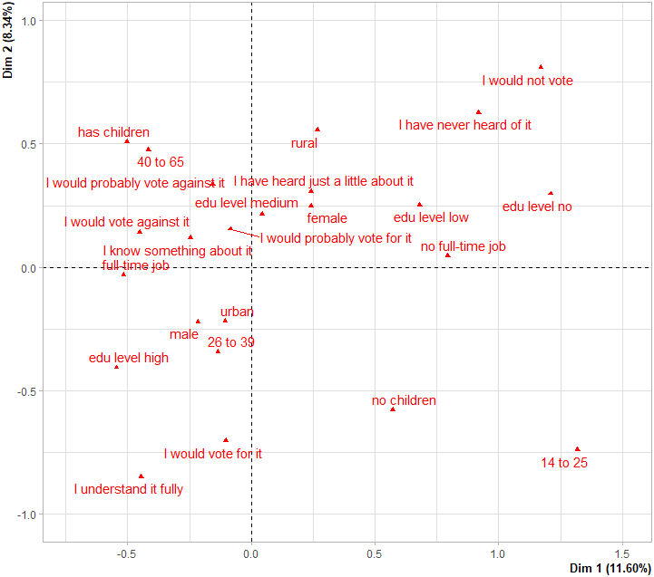
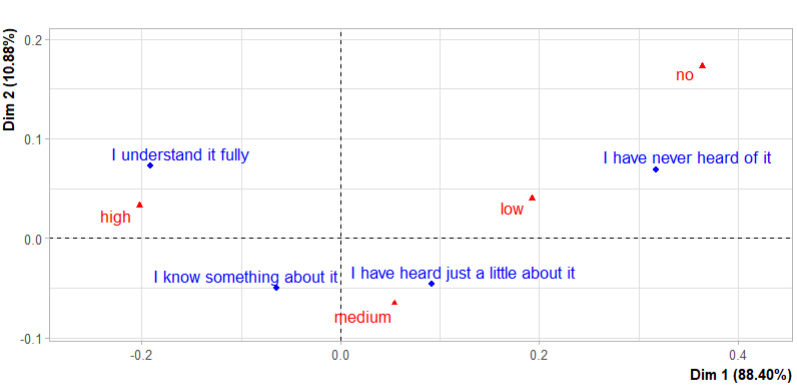

# ANAD Practical Work 2024-25
The practical work (TPs) done in the data mining course (ANAD, analyse et fouille de données) at ESI for the academic year 2024-25.
ANAD Practical Work 2024/2025

---

## 📁 Contents

This repository contains two main practical assignments for the Data Mining (ANAD) course:

1. **TP1: Analyse Factorielle des Correspondances (AFC) & Analyse des Correspondances Multiples (ACM) (Multiple Correspondence Analysis, MCA, and Correspondence Analysis, CA)**
2. **TP2: Analyse en Composantes Principales (ACP) (Principal Component Analysis, PCA)**

---

## 📊 TP1 – Multiple Correspondence Analysis (MCA) and Correspondence Analysis (CA)

### ✨ Objective
Explore the associations between categorical survey data variables, particularly those related to opinions on Universal Basic Income (UBI), using MCA and CA.

### 📌 Dataset
- **Source**: 2016 survey across 28 European countries on public opinion about UBI.
- **Filtered**: 8986 individuals after removing missing values.
- **Variables**: Age, gender, education, employment status, awareness of UBI, opinion, perceived effects, arguments for/against UBI, etc.

### 🧪 Methods & Tools
- Tools: `FactoMineR`, `factoextra`, `Hmisc` in R.
- Techniques: MCA on full dataset, CA on contingency tables.
- Preprocessing: Recoding, cleaning, one-hot encoding.

### 🔍 Key Results

#### 🎯 MCA (ACM)
- **Eigenvalues**: 16 dimensions; 84.03% inertia captured by first 12.
- **Axis 1 top contributors**: Age 14–25 (17,98%), no full-time job (13,39%), full-time job (8.71%), no children (8.23%), will not vote (8.11%).
- **Axis 2 top contributors**: Better awareness of UBI (13,49%), more likely to vote for (10,93%), have children (10,3%).

*Figure: MCA factor Map*

#### 📌 CA (AFC)
- **Contingency Table**: UBI awareness vs. education level.
- **Chi² Test**: Highly significant dependency.
- **Interpretation**: Higher education correlates with higher UBI awareness.

*Figure: CA Factor Map*

### 🧠 Interpretation
- Urban, educated males tend to favor UBI.
- Rural individuals or those with less education tend to oppose or are unaware.
- Employment status and family situation strongly influence opinion.

---

## 📈 TP2 – Principal Component Analysis (PCA)

### ✨ Objective
Use PCA to explore student performance data and its relationship to specialty assignments after the first-year curriculum (1CS).

### 📌 Dataset
- **198 students** with grades in 8 modules.
- **Modules**: SYS1, RES1, ANUM, RO, ORG, LANG1, IGL, THP.
- **Specialties**: 2SQ, 2ST, 2SL, 2SD.
- **Goal**: Find patterns and correlation with specialty choices.

### 🧪 Methods & Tools
- Tools: `FactoMineR`, `factoextra` in R.
- PCA with and without outliers (z-score thresholding).
- Individual projections and specialty overlays.

### 🔍 Key Results

#### 🎯 PCA
- **Axis 1**: 50.7% inertia – performance in SYS1, RES1, THP, ANUM, RO, IGL.
- **Axis 2**: 13.9% inertia – performance in LANG1 and ORG.

*Figure: PCA - Variable Contributions*

#### 🔁 Outlier Removal
- One outlier (THP score for student 21/0004) was removed.
- Slight drop in total explained variance after exclusion.

*Figure: PCA - Projection of Students by Specialty*

---

## 🛠️ Requirements

- R (>= 4.0)
- R packages: `FactoMineR`, `factoextra`, `Hmisc`, `mlbench`

---

## 📜 License

This work is provided for academic and educational purposes.

